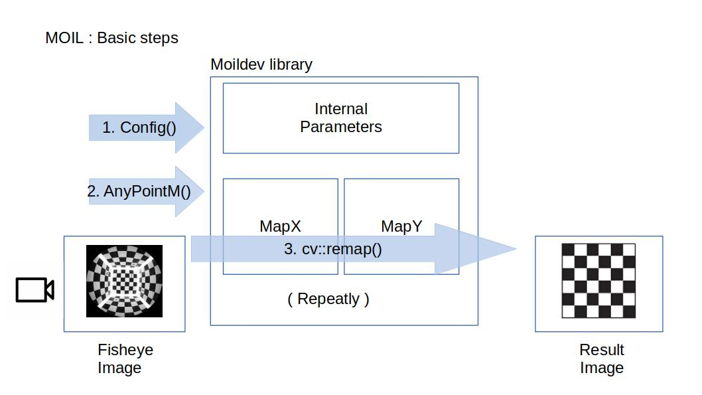
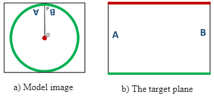
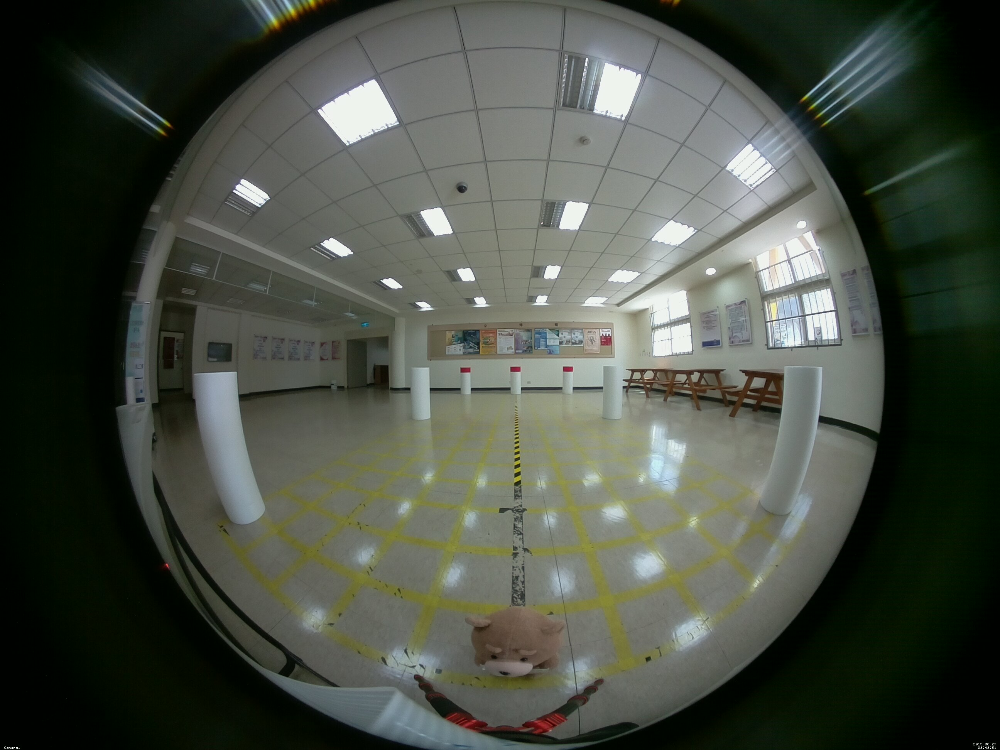
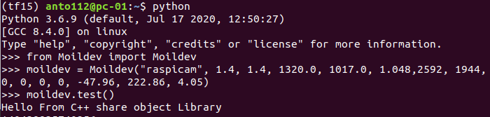
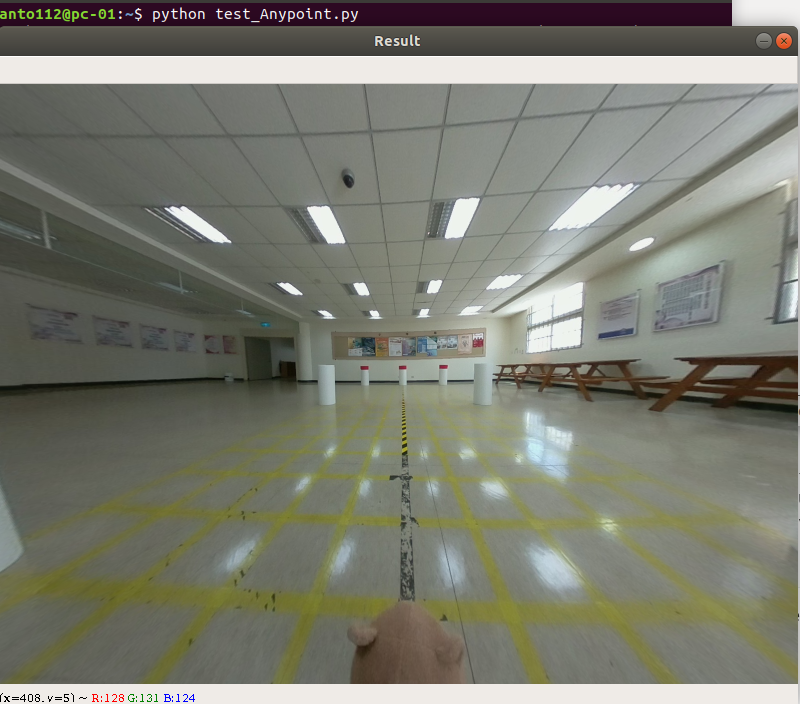
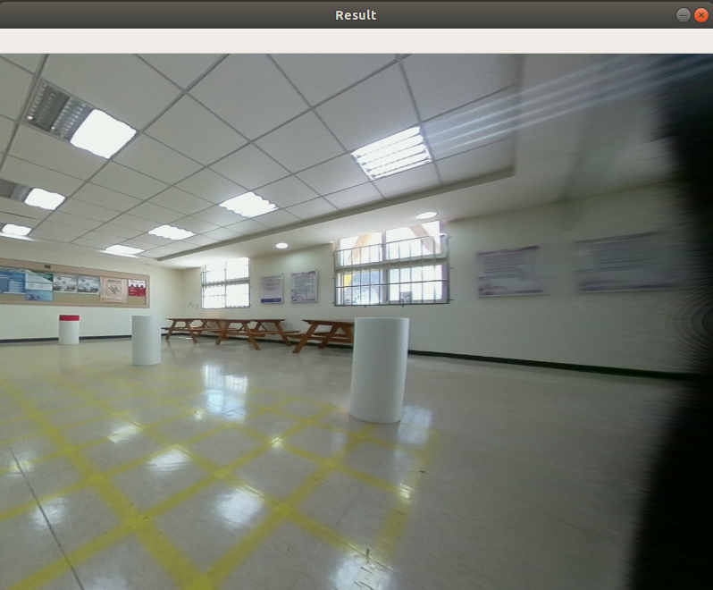
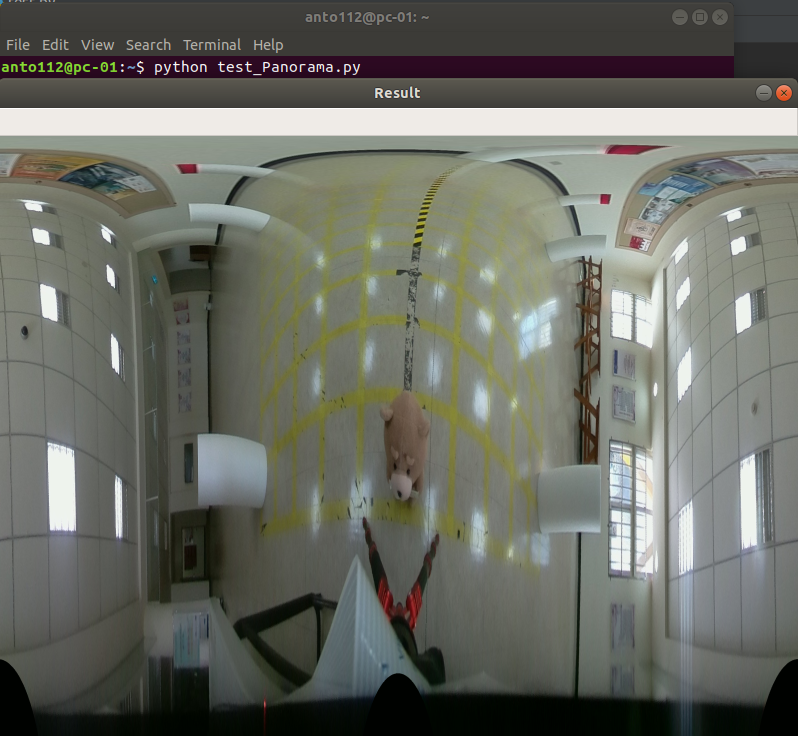
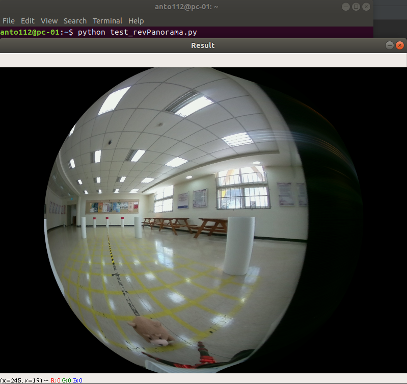

## Moildev Library

Moildev Library is a collection of functions support python to developments fisheye image applications. this function using share object library C++ wrapper by **ctypes** python.

- Anypoint image



- Panorama Image 



## 1. How to install
This library now available in pypi distribution. visit link here https://pypi.org/project/Moildev/ 
```
$ pip install moildev
```

### 2. Import Library

Open python3 from your terminal or command prompt :

```
$ python
```

Then import moildev library

```
>> from Moildev import Moildev
```

### 3. Application programming interface (API) Reference

To test this API using image from calibrated fish-eye camera, you can download the image from [this link](https://drive.google.com/file/d/1Cq8vIcsE7I8NYcL_nb8k7OBYjy9LLCx6/view?usp=sharing). the original image is showing bellow:



##### 3.1 Initial configuration

This is the initial configuration that you need provide the parameter. The camera parameter is the result from calibration camera by MOIL laboratory.  before the successive functions can work correctly,configuration is necessary in the beginning of program. 

```
moildev = Moildev(camera_name, sensor_width, sensor_height, Icx, Icy, ratio,imageWidth, imageHeight, parameter0, parameter1, parameter2, parameter3,parameter4, parameter5, calibrationRatio)
```

**Parameter:**

```
. camera_name - A string to describe this camera
. sensor_width - Camera sensor width (cm)
. sensor_height - Camera Sensor Height (cm)
. Icx - image center X coordinate(pixel)
. Icy - image center Y coordinate(pixel)
. ratio : Sensor pixel aspect ratio.
. imageWidth : Input image width
. imageHeight : Input image height  
. calibrationRatio : input image with/ calibration image width
. parameter0 .. parameter5 : calibration parameters
```

**Example:**

```
>> moildev = Moildev("raspicam", 1.4, 1.4, 1298.0, 966.0, 1.048, 2592, 1944, 0, 0, 0, 0, -47.96, 222.86, 4.05)
```

##### 3.2 test

```
moildev.test()
```

**Purpose:**

The function will return feedback from share object library to make sure the library work properly.

**Example:**

```
>> from Moildev import Moildev
>> moildev = Moildev("raspicam", 1.4, 1.4, 1320.0, 1017.0, 1.048, 2592, 1944, 0, 0, 0, 0, -47.96, 222.86, 4.05)
>> moildev.test()
```

When you run the code, the output will be:

```
Hello From C++ share object Library
```

Example:



##### 3.3 Anypoint mode-1

```
moildev.AnyPointM(mapX, mapY, w, h, alphaOffset, betaOffset, zoom, m_ratio)
```

**Purpose:**

Anypoint Mode 1, the purpose is to generate a pair of X-Y Maps for the specified alpha, beta and zoom parameters, the result X-Y Maps can be used later to remap the original fisheye image to the target angle image. The result rotation is betaOffset degree rotation around the Z-axis(roll) after alphaOffset degree rotation around the X-axis(pitch).

**Parameter:**

```
. mapX : memory pointer of result X-Map   
. mapY : memory pointer of result Y-Map
. w : width of the Map (both mapX and mapY)
. h : height of the Map (both mapX and mapY)
. alphaOffset : alpha offset 
. betaOffset : beta offset
. zoom : decimal zoom factor, normally 1..12
. m_ratio : input imageWidth / sensor_width, m_ratio is normally equal to 1.  
```

**Example :**

```
>> from Moildev import Moildev
>> import numpy as np
>> import cv2

>> moildev = Moildev("raspicam", 1.4, 1.4, 1298.0, 966.0, 1.048, 2592, 1944, 0, 0, 0, 0, -47.96, 222.86, 4.05)
>> image_input = cv2.imread("./Image/image.jpg")
>> h, w = image_input.shape[:2]
>> sensor_width = 2592
>> image_width = w
>> m_ratio = image_width / sensor_width
>> mapX = np.zeros((h, w), dtype=np.float32)
>> mapY = np.zeros((h, w), dtype=np.float32)
>> alphaOffset = 0
>> betaOffset = 0
>> zoom = 4

>> moildev.AnyPointM(mapX, mapY, w, h, alphaOffset, betaOffset, zoom, m_ratio)
>> result = cv2.remap(image_input, mapX, mapY, cv2.INTER_CUBIC)
>> result = cv2.resize(result, (800, 600), interpolation=cv2.INTER_AREA)
>> cv2.imshow("Result", result)
>> cv2.waitKey(0)
```

**Create file contain the code above, then running by python.**



##### 3.4 Anypoint mode-2

```
moildev.AnyPointM2(mapX, mapY, w, h, thetaX_degree, thetaY_degree, zoom, m_ratio)
```

**Purpose :**

Anypoint mode 2, the purpose is to generate a pair of X-Y Maps for the specified thetaX, thetaY and zoom parameters, the result X-Y Maps can be used later to remap the original fisheye image to the target angle image. The result rotation is thetaY degree rotation around the Y-axis(yaw) after thetaX degree rotation around the X-axis(pitch).

**Parameter:**

```
. mapX : memory pointer of result X-Map   
. mapY : memory pointer of result Y-Map
. w : width of the Map (both mapX and mapY)
. h : height of the Map (both mapX and mapY)
. thetaX_degree : thetaX 
. thetaY_degree : thetaY
. zoom : decimal zoom factor, normally 1..12
. m_ratio : input imageWidth / sensor_width, m_ratio is normally equal to 1.  
```

**Example :**

```
>> from Moildev import Moildev
>> import numpy as np
>> import cv2

>> moildev = Moildev("raspicam", 1.4, 1.4, 1298.0, 966.0, 1.048, 2592, 1944, 0, 0, 0, 0, -47.96, 222.86, 4.05)
>> image_input = cv2.imread("./Image/image.jpg")
>> h, w = image_input.shape[:2]
>> sensor_width = 2592
>> image_width = w
>> m_ratio = image_width / sensor_width
>> mapX = np.zeros((h, w), dtype=np.float32)
>> mapY = np.zeros((h, w), dtype=np.float32)
>> thetaX_degree = 0
>> thetaY_degree = 65
>> zoom = 4

>> moildev.AnyPointM2(mapX, mapY, w, h, thetaX_degree, thetaY_degree, zoom, m_ratio)
>> result = cv2.remap(image_input, mapX, mapY, cv2.INTER_CUBIC)
>> result = cv2.resize(result, (800, 600), interpolation=cv2.INTER_AREA)
>> cv2.imshow("Result", result)
>> cv2.waitKey(0)
```

##### **Create new file as and copy the code above. then running by python.**



##### 3.5 Panorama

```
moildev.PanoramaM_Rt(mapX, mapY, w, h, m_ratio, alpha_max, iC_alpha_degree, iC_beta_degree)
```

**Purpose:**

To generate a pair of X-Y Maps for alpha within 0..alpha_max degree, the result X-Y Maps can be used later to generate a panorama image from the original fish-eye image. The panorama image centered at the 3D direction with alpha = iC_alpha_degree and beta = iC_beta_degree.

**Parameter:**

```
. mapX : memory pointer of result X-Map   
. mapY : memory pointer of result Y-Map
. w : width of the Map (both mapX and mapY)
. h : height of the Map (both mapX and mapY)
. m_ratio : input imageWidth / sensor_width, m_ratio is normally equal to 1.   
. alpha_max : max of alpha. The recommended vaule is half of camera FOV. For example, use
  90 for a 180 degree fisheye images and use 110 for a 220 degree fisheye images.
. iC_alpha_degree : alpha angle of panorana center.
. iC_beta_degree : beta angle of panorama center. 
```

**Example :**

```
>> from Moildev import Moildev
>> import numpy as np
>> import cv2

>> moildev = Moildev("raspicam", 1.4, 1.4, 1298.0, 966.0, 1.048, 2592, 1944, 0, 0, 0, 0, -47.96, 222.86, 4.05)
>> image_input = cv2.imread("./Image/image.jpg")
>> h, w = image_input.shape[:2]
>> sensor_width = 2592
>> image_width = w
>> m_ratio = image_width / sensor_width
>> mapX = np.zeros((h, w), dtype=np.float32)
>> mapY = np.zeros((h, w), dtype=np.float32)
>> alpha_max = 110
>> iC_alpha_degree = 0
>> iC_beta_degree = 0

>> moildev.PanoramaM_Rt(mapX, mapY, w, h, m_ratio, alpha_max, iC_alpha_degree, iC_beta_degree)
>> result = cv2.remap(image_input, mapX, mapY, cv2.INTER_CUBIC)
>> result = cv2.resize(result, (800, 600), interpolation=cv2.INTER_AREA)
>> cv2.imshow("Result", result)
>> cv2.waitKey(0)
```

**Create new file as and copy the code above. then running by python.**




##### 3.6 Reverse panorama image to reconstruct the center image

```
revPanorama(panoImage, result, w, h, alpha_max, iC_beta_degree)
```

**Purpose:**

To generate the image reverse image from panorama that can change the focus direction from the original images.  The panorama reverse image centered at the 3D direction with alpha_max = max of alpha and beta = iC_beta_degree.

**Parameter:**

```
. panoImage : Input of panorama_Rt image
. result :  Memory pointer of result image
. w : width of the Map (both mapX and mapY)
. h : height of the Map (both mapX and mapY)
. alpha_max : max of alpha. The recommended vaule is half of camera FOV. For example, use
  90 for a 180 degree fisheye images and use 110 for a 220 degree fisheye images.
. iC_beta_degree : beta angle of panorama center. 
```

**Example :**

```
>> from Moildev import Moildev
>> import numpy as np
>> import cv2

>> moildev = Moildev("raspicam", 1.4, 1.4, 1298.0, 966.0, 1.048, 2592, 1944, 0, 0, 0, 0, -47.96, 222.86, 4.05)
>> image_input = cv2.imread("./Image/image.jpg")
>> h, w = image_input.shape[:2]
>> sensor_width = 2592
>> image_width = w
>> m_ratio = image_width / sensor_width
>> >> size = h, w, 3
>> result = np.zeros(size, dtype=np.uint8)
>> mapX = np.zeros((h, w), dtype=np.float32)
>> mapY = np.zeros((h, w), dtype=np.float32)
>> alpha_max = 110
>> iC_alpha_degree = 50
>> iC_beta_degree = 90

>> moildev.PanoramaM_Rt(mapX, mapY, w, h, m_ratio, alpha_max, iC_alpha_degree, iC_beta_degree)
>> panoImage = cv2.remap(image_input, mapX, mapY, cv2.INTER_CUBIC)
>> moildev.revPanorama(panoImage, result, w, h, alpha_max, iC_beta_degree)
>> result = cv2.resize(result, (800, 600), interpolation=cv2.INTER_AREA)
>> cv2.imshow("Result", result)
>> cv2.waitKey(0)
```

**Create new file as and copy the code above. then running by python.**



##### 3.8 Rotate

```
Rotate(w, h, src, dst, angle)
```

**Purpose:**

To rotate the image with specific angle and fast.

**Parameter:**

```
. w : width of the Map (both mapX and mapY)
. h : height of the Map (both mapX and mapY)
. dst : destination image
. src : source image/ image input
. angle : the number of degree that want to rotate image
```

**Example :**

```
>> from Moildev import Moildev
>> import numpy as np
>> import cv2

>> moildev = Moildev("raspicam", 1.4, 1.4, 1320.0, 1017.0, 1.048, 2592, 1944, 0, 0, 0, 0, -47.96, 222.86, 4.05)
>> image_input = cv2.imread("./Image/image.jpg")
>> h, w = image_input.shape[:2]
>> size = h, w, 3
>> dst = np.zeros(size, dtype=np.uint8)
>> angle = 45

>> moildev.Rotate(w, h, src, dst, angle)
>> result = cv2.resize(dst, (800, 600), interpolation=cv2.INTER_AREA)
>> cv2.imshow("Result", result)
>> cv2.waitKey(0)
```

### 4. About Us

***Omnidirectional, Surveillance and Imaging laboratory (OIL-Lab) Ming Chi University of Technology, Taiwan***

